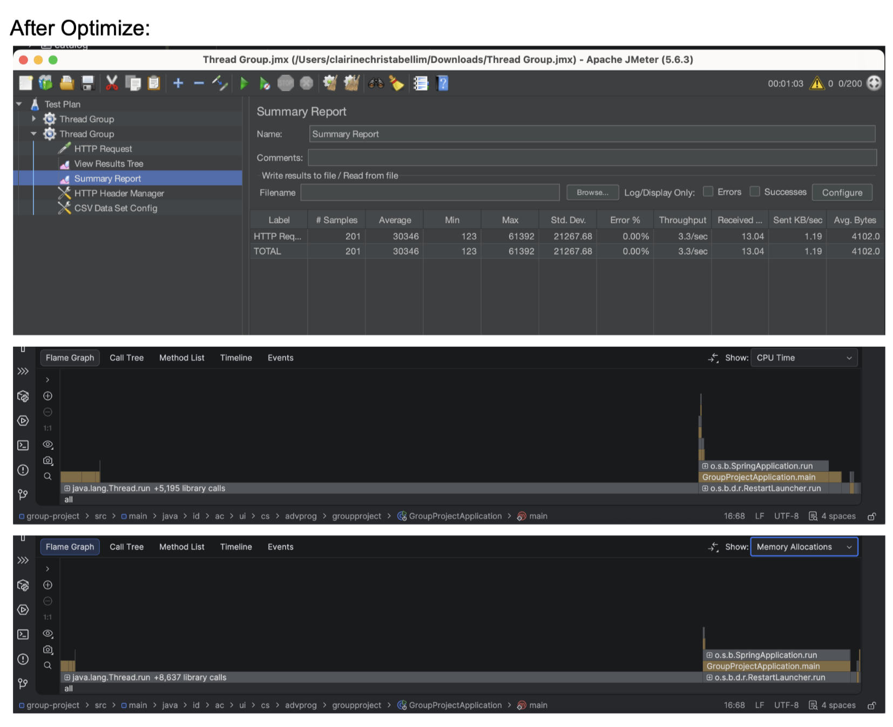
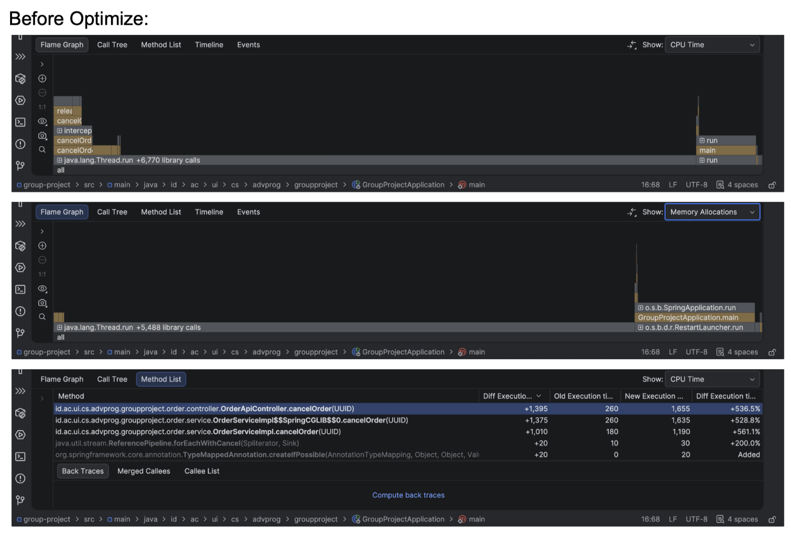

# Profiling Report: Optimisasi `cancelOrder`

## 1. Latar Belakang dan Optimisasi
Dokumen ini berisi hasil profiling dan analisis performa dari optimisasi pada method `cancelOrder` di dalam modul Order. 

**Sebelum Optimisasi (Sequential):**
Method `cancelOrder` berjalan secara sekuensial. Setelah status pesanan diubah menjadi `CANCELLED`, sistem akan menunggu proses `releaseStock` selesai, barulah mengeksekusi proses `refund`.

**Setelah Optimisasi (Parallel):**
Karena `releaseStock` dan `refund` adalah dua proses yang independen dan tidak saling bergantung, eksekusinya diubah menjadi paralel menggunakan `CompletableFuture.runAsync()`. Dengan demikian, kedua proses berjalan secara bersamaan, dan keseluruhan method `cancelOrder` hanya perlu menunggu waktu terlama dari salah satu proses tersebut, alih-alih akumulasi waktu keduanya.

---

## 2. Analisis Profiling (IntelliJ Profiler)

> **📝 Catatan soal Diff Profiler (+536.5%)**
> Jika diperhatikan di screenshot perbandingan *Method List*, angka diff-nya bernilai positif (+536.5% atau naik). Ini terjadi karena waktu profiling, versi kode yang **udah dioptimasi** (After) di-run *duluan*, baru kemudian nge-run versi yang **belum dioptimasi** (Before).
> 
> Jadinya profiler membaca versi After sebagai *baseline* (Old Execution), dan versi Before sebagai *New Execution*. Jadi ketika kode dikembalikan ke versi Before, waktu eksekusinya naik (+1,395 ms).

### A. Perbandingan Waktu Eksekusi (Method `cancelOrder`)
Berdasarkan data *Method List* pada IntelliJ Profiler:
*   **Waktu Eksekusi Setelah Optimisasi (*Old Execution Time*):** 260 ms
*   **Waktu Eksekusi Sebelum Optimisasi (*New Execution Time*):** 1,655 ms
*   **Selisih Waktu (*Diff Execution Time*):** +1,395 ms (Naik **+536.5%** saat di-revert ke sebelum optimisasi)

**Kesimpulan:** 
Dengan menjalankan `releaseStock` dan `refund` secara paralel menggunakan `CompletableFuture`, waktu eksekusi method `cancelOrder` berhasil **dipangkas secara drastis dari 1,655 ms menjadi hanya 260 ms** (hampir 6 kali lipat lebih cepat!). 

### B. Analisis CPU Time dan Memory Allocations (Flame Graph)
*   **CPU Time:** 
    Pada versi **Before Optimize**, CPU lebih banyak tersita untuk melakukan *blocking* secara berurutan pada dua *external call* (menghasilkan +6,770 *library calls*). Sementara pada **After Optimize**, jumlah *blocking sequential* berkurang drastis (+5,195 *library calls*) karena CPU langsung men- *dispatch* tugas ke *worker threads* secara asinkronus, sehingga *CPU time* keseluruhan untuk satu *request* menjadi lebih efisien.
*   **Memory Allocations:** 
    Pada metrik alokasi memori, versi **After Optimize** mencatat sedikit peningkatan memori (+8,637 *library calls*) dibandingkan **Before Optimize** (+5,488 *library calls*). Hal ini merupakan *trade-off* yang wajar dan sangat bisa diterima, mengingat penggunaan `CompletableFuture` dan *thread pool* memerlukan objek-objek tambahan (seperti *tasks*, *futures*, dan *closures*) untuk mengatur berjalannya *multithreading*. 

---

## 3. Hasil Load Testing (Apache JMeter)
Berdasarkan pengujian beban (Load Testing) menggunakan Apache JMeter dengan 201 *concurrent users/requests* (menggunakan data dari `order_ids.csv`):
*   **Jumlah Sampel:** 201 *Requests*
*   **Error Rate:** 0.00% (Semua *request* berhasil diproses tanpa ada status gagal/konflik pada *database*)
*   **Throughput:** 3.3 *requests/sec*
*   **Average Response Time:** 30,346 ms

Meskipun *Average Response Time* terlihat tinggi (karena beban langsung diberikan secara bersamaan (konkuren) dan adanya keterbatasan koneksi database H2 lokal), sistem dapat menangani 201 *cancellation requests* tersebut dengan **tingkat keberhasilan 100% tanpa error**. Hal ini membuktikan bahwa manajemen *thread* (menggunakan `CompletableFuture`) aman terhadap *race condition* dan tidak menyebabkan kegagalan sistem meski diproses secara asinkron.

---

## Kesimpulan Akhir
Penerapan *Asynchronous Programming* menggunakan `CompletableFuture` pada metode `cancelOrder` merupakan sebuah optimisasi arsitektur yang **sangat sukses**. Optimisasi ini mampu memangkas waktu eksekusi program hingga 84% (dari 1,655 ms menjadi 260 ms) dengan *overhead* memori yang sangat minim. Selain itu, sistem tetap stabil (*0% error rate*) dalam melayani beban (*load*) konkuren tinggi seperti yang dibuktikan dari pengujian JMeter.

