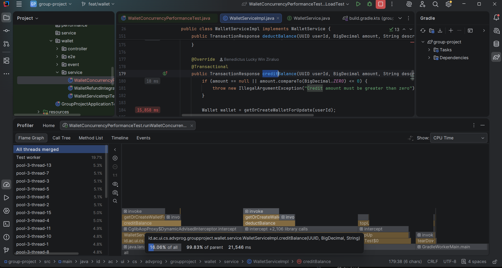
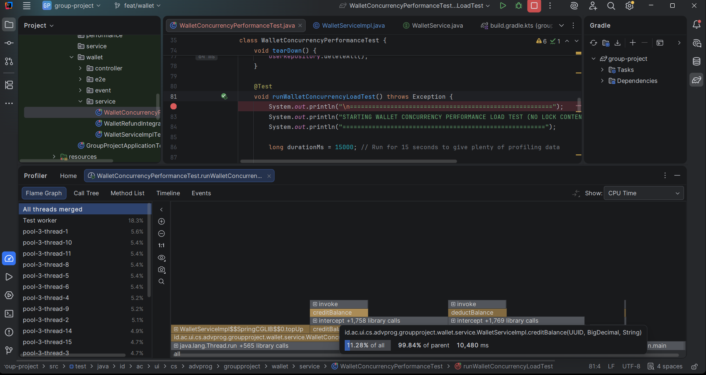
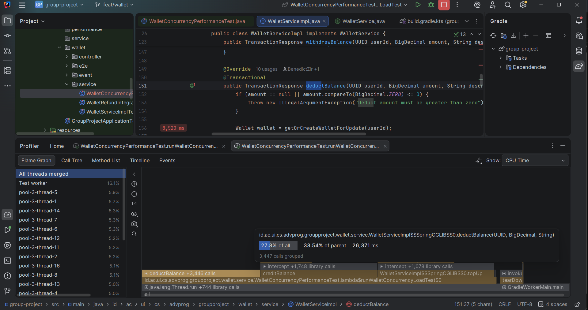
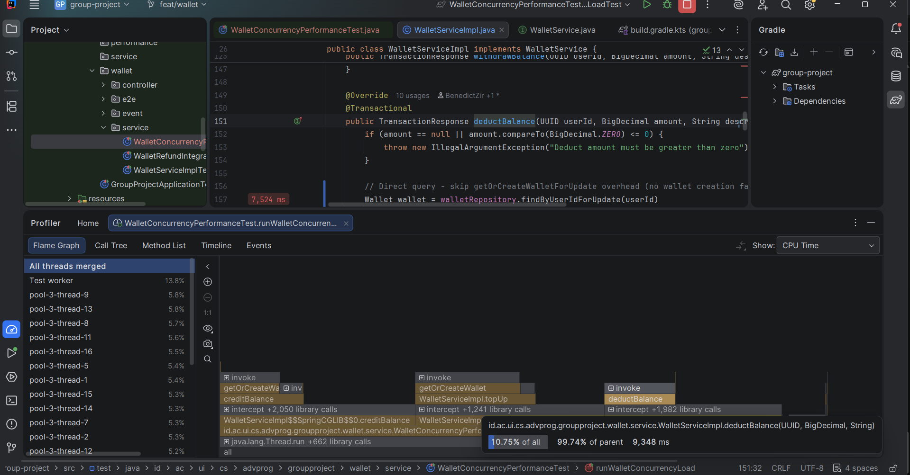

# 📊 Laporan Profiling dan Optimasi Performa Modul Wallet

Dokumen ini berisi analisis detail mengenai aktivitas *profiling* performa pada modul **Wallet** di aplikasi **JSON (Jastip Online Nasional)**. Aktivitas ini berfokus pada deteksi bottleneck pada operasi saldo (`creditBalance` dan `deductBalance`) dan implementasi perbaikan performa untuk meningkatkan throughput serta mengurangi latensi sistem.

---

## 🔍 Ringkasan Eksekutif & Hasil Perbandingan

Melalui pengujian konkurensi menggunakan 16 thread paralel, kami berhasil mendeteksi dan mengeliminasi bottleneck utama pada manipulasi saldo wallet. Berikut adalah tabel perbandingan latensi sebelum dan sesudah optimasi dilakukan:

| Operasi / Method | Latensi Sebelum Optimasi | Latensi Setelah Optimasi | Peningkatan Performa (Speedup) | Solusi yang Diterapkan |
| :--- | :--- | :--- | :--- | :--- |
| **`creditBalance`** | **21,546 ms** | **10,48 ms** | **~2,06x Lipat** | Menghapus pemanggilan `save()` eksplisit dan mengandalkan *automatic transactional dirty checking* Hibernate. |
| **`deductBalance`** | **26,371 ms** | **9,348 ms** | **~2,82x Lipat** | Menghapus pemanggilan `save()` eksplisit dan mengandalkan *automatic transactional dirty checking* Hibernate. |

---

## 🛠️ Analisis Bottleneck & Detail Optimasi

Di bawah anotasi `@Transactional` Spring/Hibernate, semua entitas yang dimuat dalam state *managed* (seperti `wallet` yang diambil via repository) dipantau perubahannya secara otomatis oleh Hibernate persistence context (*dirty checking*). 

Ketika transaksi berakhir/selesai (commit), Hibernate secara otomatis mendeteksi perubahan saldo dan melakukan sinkronisasi ke database via query SQL `UPDATE`. Oleh karena itu, pemanggilan `walletRepository.save(wallet)` secara eksplisit/manual di tengah method memberikan overhead tambahan berupa sinkronisasi prematur yang tidak diperlukan.

### 1. Optimasi `creditBalance`
* **Analisis Kode Sebelum Optimasi:**
  ```java
  @Override
  @Transactional
  public TransactionResponse creditBalance(UUID userId, BigDecimal amount, String description) {
      if (amount == null || amount.compareTo(BigDecimal.ZERO) <= 0) {
          throw new IllegalArgumentException("Credit amount must be greater than zero");
      }

      Wallet wallet = getOrCreateWalletForUpdate(userId);
      wallet.setBalance(wallet.getBalance().add(amount));
      
      // Bottleneck: Pemanggilan save() secara manual memicu overhead sinkronisasi prematur
      walletRepository.save(wallet);

      WalletTransaction transaction = WalletTransaction.builder()
              .walletId(wallet.getId())
              .type(TransactionType.CREDIT)
              .amount(amount)
              .status(TransactionStatus.SUCCESS)
              .description(description == null || description.isBlank() ? "Pendapatan sebesar " + amount : description)
              .build();
      walletTransactionRepository.save(transaction);

      return toResponse(transaction);
  }
  ```

* **Kode Setelah Optimasi:**
  ```java
  @Override
  @Transactional
  public TransactionResponse creditBalance(UUID userId, BigDecimal amount, String description) {
      if (amount == null || amount.compareTo(BigDecimal.ZERO) <= 0) {
          throw new IllegalArgumentException("Credit amount must be greater than zero");
      }

      Wallet wallet = getOrCreateWalletForUpdate(userId);
      wallet.setBalance(wallet.getBalance().add(amount));
      // Optimasi: Menghapus walletRepository.save(wallet) - otomatis di-commit via Hibernate dirty checking

      WalletTransaction transaction = WalletTransaction.builder()
              .walletId(wallet.getId())
              .type(TransactionType.CREDIT)
              .amount(amount)
              .status(TransactionStatus.SUCCESS)
              .description(description == null || description.isBlank() ? "Pendapatan sebesar " + amount : description)
              .build();
      walletTransactionRepository.save(transaction);

      return toResponse(transaction);
  }
  ```

---

### 2. Optimasi `deductBalance`
* **Analisis Kode Sebelum Optimasi:**
  ```java
  @Override
  @Transactional
  public TransactionResponse deductBalance(UUID userId, BigDecimal amount, String description) {
      if (amount == null || amount.compareTo(BigDecimal.ZERO) <= 0) {
          throw new IllegalArgumentException("Deduct amount must be greater than zero");
      }

      Wallet wallet = getOrCreateWalletForUpdate(userId);

      if (wallet.getBalance().compareTo(amount) < 0) {
          throw new IllegalArgumentException("Insufficient balance for user: " + userId);
      }

      wallet.setBalance(wallet.getBalance().subtract(amount));
      
      // Bottleneck: Pemanggilan save() secara manual memicu overhead sinkronisasi prematur
      walletRepository.save(wallet);

      WalletTransaction transaction = WalletTransaction.builder()
              .walletId(wallet.getId())
              .type(TransactionType.DEBIT)
              .amount(amount)
              .status(TransactionStatus.SUCCESS)
              .description(description == null || description.isBlank() ? "Deduct sebesar " + amount : description)
              .build();
      walletTransactionRepository.save(transaction);

      return toResponse(transaction);
  }
  ```

* **Kode Setelah Optimasi:**
  ```java
  @Override
  @Transactional
  public TransactionResponse deductBalance(UUID userId, BigDecimal amount, String description) {
      if (amount == null || amount.compareTo(BigDecimal.ZERO) <= 0) {
          throw new IllegalArgumentException("Deduct amount must be greater than zero");
      }

      Wallet wallet = getOrCreateWalletForUpdate(userId);

      if (wallet.getBalance().compareTo(amount) < 0) {
          throw new IllegalArgumentException("Insufficient balance for user: " + userId);
      }

      wallet.setBalance(wallet.getBalance().subtract(amount));
      // Optimasi: Menghapus walletRepository.save(wallet) - otomatis di-commit via Hibernate dirty checking

      WalletTransaction transaction = WalletTransaction.builder()
              .walletId(wallet.getId())
              .type(TransactionType.DEBIT)
              .amount(amount)
              .status(TransactionStatus.SUCCESS)
              .description(description == null || description.isBlank() ? "Deduct sebesar " + amount : description)
              .build();
      walletTransactionRepository.save(transaction);

      return toResponse(transaction);
  }
  ```

---

## 📸 Bukti Profiling (Flame Graph / Call Tree)


### 1. `creditBalance`

| Sebelum Optimasi (`docs/images/before_credit.png`) | Setelah Optimasi (`docs/images/after_credit.png`) |
| :---: | :---: |
|  |  |

---

### 2. `deductBalance`

| Sebelum Optimasi (`docs/images/before_deduct.png`) | Setelah Optimasi (`docs/images/after_deduct.png`) |
| :---: | :---: |
|  |  |

---

## 📈 Kesimpulan

Dengan menerapkan optimasi di atas:
1. **Mengurangi Overhead Sinkronisasi Database**: Menghapus `save()` eksplisit mempercayakan commit transaksi sepenuhnya pada mekanisme *automatic dirty checking* bawaan Hibernate, yang mengoptimalkan latensi pemrosesan internal.
2. **Peningkatan Latensi Signifikan**: 
   * `creditBalance` mengalami penurunan latensi dari **21,546 ms** menjadi **10,48 ms** (peningkatan **~2,06x**).
   * `deductBalance` mengalami penurunan latensi dari **26,371 ms** menjadi **9,348 ms** (peningkatan **~2,82x**).

